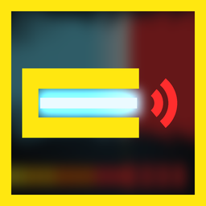
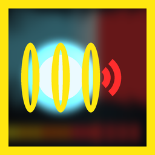

# Charge Warning & Auto Unsafe

*(formerly Railgun Warning & Auto Unsafe, before that Railgun Overcharge Warning)* - a Helldivers 2 mod for the RS-422 Railgun and the PLAS-45 Epoch.


Charging the Railgun in unsafe mode or the Epoch is a guessing game: fire too early and you lose damage, hold too long and it explodes in your hands. This mod tells you exactly when the charge does full damage, and can start every Railgun in Unsafe mode for you.

## Features

- While you charge, a low, growling electric surge with building crackle plays over the charge-up.
- Fast **warning beeps start exactly when the charge does full damage**: at 90% on the **RS-422 Railgun** (2.5 s into an unsafe charge) and at full charge on the **PLAS-45 Epoch** (2.6 s, 2x damage, before it overloads at 3.25 s). **Fire on the beeps.** A sharp discharge snap after them tells you you're past the sweet spot.
- **Silent on quick shots**: it stops as soon as you fire or let go. The Railgun's warning stays **silent in safe mode** (it reads the game's own charge value).
- **Each weapon's warning is its own option**: turn either off, and pick Loud (default), Medium (-8 dB) or Quiet (-16 dB) for each.
- Mixed to stay clear over each weapon's own charge-up. Every other sound stays exactly as the game has it.
- **Optional: Auto unsafe mode** - every new Railgun you pick up starts in Unsafe mode instead of Safe (needs Bingus Shared Loader v19 or newer).


## Options

In your mod manager (Arsenal / HD2 Mod Manager), open the mod's options (Arsenal: the sliders button on the mod's row):

| Option | | What it does |
|---|---|---|
|  | **Railgun warning** (on by default) | The RS-422 Railgun's warning in unsafe mode. Pick Loud (default), Medium (-8 dB) or Quiet (-16 dB); untick it to turn it off. |
|  | **Epoch warning** (on by default) | The PLAS-45 Epoch's warning at full charge. Pick Loud (default), Medium (-8 dB) or Quiet (-16 dB); untick it to turn it off. |
|  | **Auto unsafe mode** (on by default) | Every new Railgun you pick up starts in Unsafe. Set once per Railgun: switch back to Safe and it stays Safe, also after dropping and picking it up again; a new Railgun from a new call-in starts in Unsafe again. Only your own Railgun is changed (never the Epoch or any other weapon). Needs Bingus Shared Loader v19 or newer; turn it off if you don't use the loader. |

## Requirements

- None for the warnings.
- Auto unsafe mode: [Bingus Shared Loader](https://www.nexusmods.com/helldivers2/mods/16292) v19 or newer.

## Download

Get **Charge-Warning-and-Auto-Unsafe-3.0.0.zip** from the [latest release](https://github.com/Th3chef/Charge-Warning-and-Auto-Unsafe/releases/latest) (not the "Source code" archives). Also on [Nexus Mods](https://www.nexusmods.com/helldivers2/mods/16754) and AyakaMods.

## Install / update

1. Mod manager (Arsenal / HD2 Mod Manager): add the zip (it installs over the previous version, also over Railgun Warning & Auto Unsafe 2.x) and enable it, then **Purge** and **Deploy**. Check the options once after updating from 2.x: the Railgun's volume choice may be back on Loud.
2. Manual: copy the three `9ba626afa44a3aa3.patch_0` files from one `Railgun\<level>` folder and/or one `Epoch\<level>` folder into `Helldivers 2\data` (plus the `Auto Unsafe` folder's three files for that option), renaming each set to the next free patch number if you already have patch files with that name.

## Uninstall

Disable it in your mod manager, then Purge and Deploy, or delete the patch files you copied.

## Compatibility

- Conflicts with any other mod that replaces the Railgun's sounds (`content/audio/wep_railgun`) or the Epoch's sounds (`content/audio/wep_plasma_blaster`), including other sound replacers and the older "Railgun Max charge warning sound". Only one of them can be active per weapon; turn this mod's warning off for that weapon instead.
- Built on the game's current sounds for both weapons (October 2026 game version). Patch-proof by design: it only adds to each weapon's own sounds, so after a game patch it keeps working; if a patch changes a weapon's audio, an update is one rebuild.
- Auto unsafe mode only changes your own Railgun and finds what it needs in the game's code at start-up, so a game patch doesn't break it; if it can't find something it stays off and says so in its log.
- Client-side only. The warnings work online and offline.

## Known limitations

- The timing assumes each weapon's normal charge (Railgun: 90% after 2.5 seconds in unsafe mode; Epoch: full charge after 2.6 seconds). If the game changes a charge speed, the beeps will be early or late until an update.
- The Epoch has its own fast beeping near full charge; this mod's warning plays on top of it and marks the full-damage moment.
- The warnings are part of each weapon's own sounds, so you may also hear them from other players' Railguns and Epochs.
- The Railgun's surge stays silent until the charge is past what safe mode can reach, so its first moments may be quiet or cut.

## How it works

Each warning is one sound added to that weapon's own sound bank. It starts with the charge-up, delayed so its first warning beep lands on the full-damage moment, and its volume follows the game's charge value. Releasing the trigger or firing stops it. It doesn't change any stats, damage or gameplay, only what you hear.

Auto unsafe mode is a small Bingus Shared Loader script. Right after you pick up a Railgun it hasn't seen before, it switches that Railgun's mode setting to Unsafe, the same setting the game's own Safe/Unsafe switch changes. It identifies the Railgun by its weapon type, so other charge weapons such as the Arc Thrower and the Epoch are never touched. Nothing else is changed.

## Troubleshooting

- No warning at all: check that no other sound mod for that weapon is enabled, that the weapon's warning option is ticked, that you Purged and Deployed after installing, and (Railgun) that you are in unsafe mode (safe mode is silent on purpose).
- Weapon sounds missing after a game patch: disable the mod and check for an update.
- Auto unsafe mode not working: check Bingus Shared Loader v19 or newer is installed and the option is ticked, then attach both logs to a [bug report](https://github.com/Th3chef/Charge-Warning-and-Auto-Unsafe/issues/new/choose): `RailgunAutoUnsafe.log` and `BingusSharedLoader.log` in `%LOCALAPPDATA%\CowboyBingus\Helldivers2\Logs` (type `%LOCALAPPDATA%` into the File Explorer address bar).

## Building from source

Everything in `src/` builds the release zip from your own game install (see [src/BUILDING.md](src/BUILDING.md)):

```
cd src/tools
python sound.py      # the warning sound (numpy, scipy, pyloudnorm)
python art.py        # art and option icons (pillow, playwright)
python update.py --filediver <filediver> --gamedir <Helldivers 2 folder>   # extracts both weapons' sound banks and builds
python build.py      # the mod zip, checked by verify.py; needs the game's sound banks in src/game
```

Nothing from the game is stored here: the build reads each weapon's sound bank from your install.

## Credits

Inspired by [Railgun Max charge warning sound](https://www.nexusmods.com/helldivers2/mods/481) by uskummel. This is a new mod built from scratch: new sound, new timing logic, no files from the original. Auto unsafe mode uses [Bingus Shared Loader](https://www.nexusmods.com/helldivers2/mods/16292).

## License

Copyright (c) 2026 Th3chef. All rights reserved. You may read the source, report bugs and suggest fixes; ask before reusing it or reuploading the mod. See [LICENSE](LICENSE).
