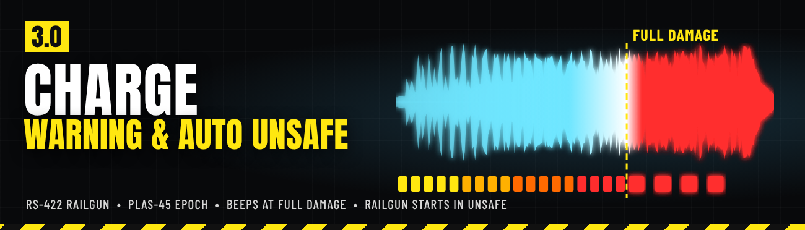
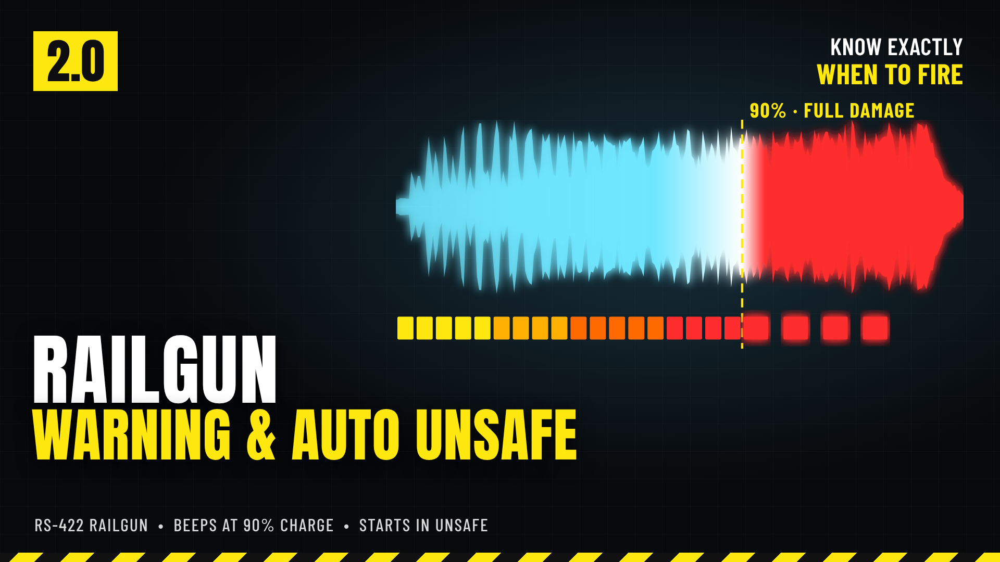
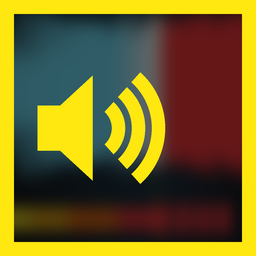
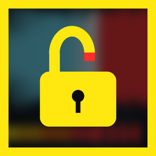

# Railgun Warning & Auto Unsafe

*(formerly Railgun Overcharge Warning)* - a Helldivers 2 mod for the RS-422 Railgun.



Charging the Railgun in unsafe mode is a guessing game: fire too early and you lose damage, hold too long and it explodes in your hands. This mod tells you exactly when the charge is at its best, and can start every Railgun in Unsafe mode for you.

## Features

- While you charge in **unsafe mode**, a low, growling electric surge with building crackle plays over the charge-up.
- Fast **warning beeps start exactly as the charge reaches 90%**, the point where the Railgun does full damage. **Fire on the beeps.** A sharp discharge snap after them tells you you're past the sweet spot.
- **Silent in safe mode** (it reads the game's own charge value) and **silent on quick shots** (it stops as soon as you fire or let go).
- **Adjustable volume**: Loud (default), Medium (-8 dB) or Quiet (-16 dB).
- Mixed to stay clear over the Railgun's own charge-up rumble. Every other Railgun sound stays exactly as the game has it.
- **Optional: Auto unsafe mode** - every new Railgun you pick up starts in Unsafe mode instead of Safe (needs Bingus Shared Loader).



## Options

In your mod manager (Arsenal / HD2 Mod Manager), open the mod's options (Arsenal: the sliders button on the mod's row):

| Option | | What it does |
|---|---|---|
|  | **Warning volume** | Loud (default), Medium (-8 dB) or Quiet (-16 dB). |
|  | **Auto unsafe mode** (on by default) | Every new Railgun you pick up starts in Unsafe. Set once per Railgun: switch back to Safe and it stays Safe, also after dropping and picking it up again; a new Railgun from a new call-in starts in Unsafe again. Only your own Railgun is changed. Needs Bingus Shared Loader; turn it off if you don't use the loader. |

## Requirements

- None for the warning sound.
- Auto unsafe mode: [Bingus Shared Loader](https://www.nexusmods.com/helldivers2/mods/16292).

## Download

Get **Railgun-Warning-and-Auto-Unsafe-2.0.0.zip** from the [latest release](https://github.com/Th3chef/Railgun-Warning-and-Auto-Unsafe/releases/latest) (not the "Source code" archives). Also on [Nexus Mods](https://www.nexusmods.com/helldivers2/mods/16754) and AyakaMods.

## Install / update

1. Mod manager (Arsenal / HD2 Mod Manager): add the zip (it installs over the previous version) and enable it, then **Purge** and **Deploy**.
2. Manual: copy the three `9ba626afa44a3aa3.patch_0` files from one `Volume\<level>` folder into `Helldivers 2\data` (plus the `Auto Unsafe` folder's three files for that option), renaming them to the next free patch number if you already have patch files with that name.

## Uninstall

Disable it in your mod manager, then Purge and Deploy, or delete the patch files you copied.

## Compatibility

- Conflicts with any other mod that replaces the Railgun's sounds (`content/audio/wep_railgun`), including other Railgun sound replacers and the older "Railgun Max charge warning sound". Only one of them can be active.
- Built on the game's current Railgun sounds (unchanged since the September 2026 game version). Patch-proof by design: it only adds to the Railgun's own sounds, so after a game patch it keeps working; if a patch changes the Railgun's audio, an update is one rebuild.
- Auto unsafe mode only changes your own Railgun and finds what it needs in the game's code at start-up, so a game patch doesn't break it; if it can't find something it stays off and says so in its log.
- Client-side only. The warning works online and offline.

## Known limitations

- The timing assumes the normal unsafe charge (90% after 2.5 seconds). If the game changes the charge speed, the beeps will be early or late.
- The surge stays silent until the charge is past what safe mode can reach, so its first moments may be quiet or cut.
- The warning is part of the Railgun's own sounds, so you may also hear it from other players' Railguns.
- Auto unsafe mode is new in 2.0.0. If a Railgun ever stays in Safe, its log says why (see Troubleshooting).

## How it works

The warning is one sound added to the game's own Railgun sound bank. It starts with the charge-up, delayed so its first warning beep lands 2.5 seconds in (90% charge), and its volume follows the game's Railgun charge value: silent until the charge is past what safe mode can reach. Releasing the trigger or firing stops it. It doesn't change any stats, damage or gameplay, only what you hear.

Auto unsafe mode is a small Bingus Shared Loader script. Right after you pick up a Railgun it hasn't seen before, it switches that Railgun's mode setting to Unsafe, the same setting the game's own Safe/Unsafe switch changes. Nothing else is touched.

## Troubleshooting

- No warning at all: check that no other Railgun sound mod is enabled, that you Purged and Deployed after installing, and that you are in unsafe mode (safe mode is silent on purpose).
- Railgun sounds missing after a game patch: disable the mod and check for an update.
- Auto unsafe mode not working: check Bingus Shared Loader is installed and the option is ticked, then attach its log to a [bug report](https://github.com/Th3chef/Railgun-Warning-and-Auto-Unsafe/issues/new/choose): `RailgunAutoUnsafe.log` in `%LOCALAPPDATA%\CowboyBingus\Helldivers2\Logs` (type `%LOCALAPPDATA%` into the File Explorer address bar).

## Building from source

Everything in `src/` builds the release zip from your own game install (see [src/BUILDING.md](src/BUILDING.md)):

```
cd src/tools
python sound.py      # the warning sound (numpy, scipy, pyloudnorm)
python art.py        # art and option icons (pillow, playwright)
python build.py      # the mod zip; needs the game's Railgun sound bank in src/game (update.py extracts it with Filediver)
```

Nothing from the game is stored here: the build reads the game's Railgun sound bank from your install.

## Credits

Inspired by [Railgun Max charge warning sound](https://www.nexusmods.com/helldivers2/mods/481) by uskummel. This is a new mod built from scratch: new sound, new timing logic, no files from the original. Auto unsafe mode uses [Bingus Shared Loader](https://www.nexusmods.com/helldivers2/mods/16292).

## License

Copyright (c) 2026 Th3chef. All rights reserved. You may read the source, report bugs and suggest fixes; ask before reusing it or reuploading the mod. See [LICENSE](LICENSE).
